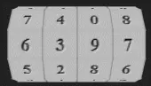

# LOCK<sub><sub><sup><sup><sub> 🔒&#xFE0E; </sub></sup></sup></sub></sub>JS
Lock.js is a javaScript library for generating numbers lock.

## Demo

[chalda.github.io/lock.js](https://chalda-pnuzig.github.io/lock.js)

## Features

- **Interactive** - You can change combination by clicking, dragging or using the mouse wheel
- **Events** - There are events on change and when the entered code is the correct one or not
- **Shuffle** — You can randomize the lock procedurally
- **Customizzable** — It's easy to change the look via CSS



## Installation and files

```html
<link rel="stylesheet" href="dist/lock.css">
<script src="dist/lock.min.js"></script>
```
```html
<div id="lock"></div>
<script>
	new Lock();
</script>
```
All pre-built files needed to use Lock can be found in the "dist" folder.

If you're looking to get started with minimal fuss, include `dist/lock.min.js`  and `dist/lock.css`.

- [**dist/**](dist)
    - [lock.min.js](dist/lock.min.js) — Minimized version
    - [lock.css](dist/lock.css) — Core style
- [**src/**](src)
    - [styles/](src)
        - [lock.scss](src/styles/lock.scss) — Core styles
    - [js/](src)
        - [lock.js](src/js/lock.js) — Full version

You can install this module as a component from NPM:

```bash
npm install @chalda/lock.js
```
You can also include this library in your HTML page directly from a CDN:

```html
<link rel="stylesheet" href="https://unpkg.com/@chalda/lock.js/dist/lock.css">
<script src="https://unpkg.com/@chalda/lock.js/dist/lock.min.js"></script>
```
### Usage

```js
new Lock(options);
```
### Options

The `Lock` parameter is a single optional `options` object, which has the following properties:
<!-- OPTIONS_TABLE  -->
| Option     | Type                                                                                                 | Default | Description
|------------|------------------------------------------------------------------------------------------------------|---------|--------------------
| `id`       | _string_                                                                                             | lock    | The id of the div where insert the lock                                                                                                                            
| `wheels`   | _number_                                                                                             | 5       | The numbers of wheels. If not specified then take the length of `code` option (if specified)                                                                       
| `items`    | _number&#124;string[]_                                                                               | 10      | The number of digits that can be chosen or an array of elements or an array of strings                                                                             
| `code`     | _number&#124;string&#124;string[]_                                                                   | 00000   | The code to open the lock. If not specified then take the first element of `items` repeated `wheels` times                                                         
| `encoded`  | _boolean_                                                                                            | false   | If true the `code` option is considered obfuscated by the `encode` method                                                                                          
| `timeout`  | _number_                                                                                             | 500     | The amount of time before the code can be changed again                                                                                                            
| `diameter` | _number_                                                                                             | 80      | The diameter of the lock                                                                                                                                           
| `onChange` | _Function<ul><li>_Array_ `code` </li><li>_boolean_ `isOpen` </li><li>_number_ `attempts` </li></ul>_ |         | This function is called upon every change to the lock. Pass the current code (`code`), if the lock is open (`isOpen`) and the number of attempts made (`attempts`) 
| `onOpen`   | _Function<ul><li>_number_ `attempts` </li></ul>_                                                     |         | This function is called when the lock opens (i.e. the `code` option matches)                                                                                       
| `onClose`  | _Function<ul><li>_number_ `attempts` </li></ul>_                                                     |         | This function is called when the lock closes (only when it's already open)                                                                                         
<!-- OPTIONS_TABLE  -->

### Methods

<!-- METHODS_TABLE  -->
| Method        | Params                                                                                                                                                                                                                                              | Return     | Description
|---------------|-----------------------------------------------------------------------------------------------------------------------------------------------------------------------------------------------------------------------------------------------------|------------|--------------------
| `getCode`     |                                                                                                                                                                                                                                                     | _string[]_ | Return the current code<br><sub>Example:</sub><br>`let lock = new Lock();`<br>`lock.getCode();`                                                                                                                      
| `getAttempts` |                                                                                                                                                                                                                                                     | _number_   | Return the number of attempts<br><sub>Example:</sub><br>`let lock = new Lock();`<br>`lock.getAttempts();`                                                                                                            
| `isOpen`      |                                                                                                                                                                                                                                                     | _boolean_  | Return true if the lock is open<br><sub>Example:</sub><br>`let lock = new Lock();`<br>`lock.isOpen();`                                                                                                               
| `setCode`     | <ol><li>_number&#124;string&#124;string[]_ `code` : The new code to set</li><li>(optional) _boolean_ `animation` : If true the code changes with an animation, default:true</li></ol>                                                               | _Lock_     | Set the code of lock<br><sub>Example:</sub><br>`let lock = new Lock();`<br>`lock.setCode('12345');`                                                                                                                  
| `shuffle`     | <ol><li>(optional) _number_ `min` : Minimum number of rotations, default:10</li><li>(optional) _number_ `max` : Max number of rotations, default:100</li><li>(optional) _number_ `time` : Time of rotations in milliseconds, default:2500</li></ol> | _string[]_ | Shuffle the lock by turning each wheel between`min` and `max` times taking `time`  milliseconds.The method returns the new `code`<br><sub>Example:</sub><br>`let lock = new Lock();`<br>`lock.shuffle(50,150,1000);` 
| `encode`      | <ol><li>_number&#124;string&#124;string[]_ `text` : The text to encode</li></ol>                                                                                                                                                                    | _string_   | Encode a string<br><sub>Example:</sub><br>`// Returns 'JD13TWo0bk1qNFhN'`<br>`Lock.encode("123");`                                                                                                                   
| `decode`      | <ol><li>_number&#124;string&#124;string[]_ `text` : The text to decode</li></ol>                                                                                                                                                                    | _string[]_ | Decode a string<br><sub>Example:</sub><br>`// Returns ['1','2','3']`<br>`Lock.encode("JD13TWo0bk1qNFhN");`                                                                                                           
<!-- METHODS_TABLE  -->

--------------------------------

### License

ISC License (ISC) - Copyright &copy;2021 [Chalda Pnuzig](https://github.com/chalda-pnuzig/lock.js). See the file [LICENSE](LICENSE)